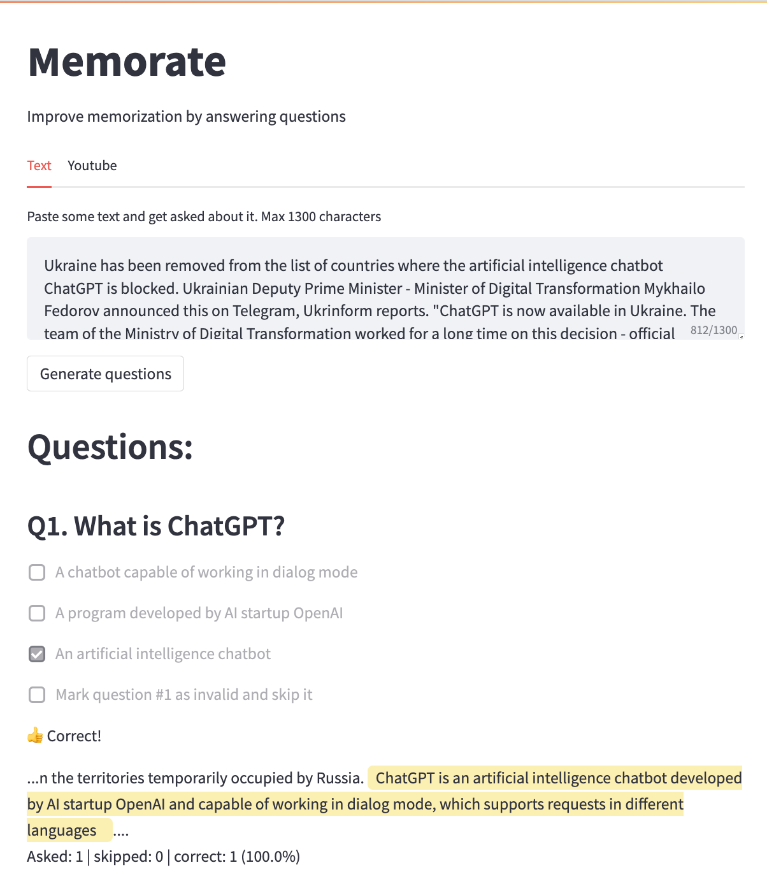

# Memorate #

Memorate is an application to generate multiple choice questions to a given text or Youtube video, indented to help with the memorization of information. This is a pet project, which I created getting acquainted with the OpenAI API (and also streamlit.io).



[Watch the video](https://www.youtube.com/embed/CbaoEHhp9tI)
## Running the app ##
```
# clone the repo
git clone git@github.com:IuriiD/memorate.git
cd memorate

# create the virtual environment and install the dependencies (commands may differ depending on your setup)
python3 -m venv env
pip3 install -r requirements.txt

# create keys.py (see keys_example.py) and provide your OPENAI_KEY, OPENAI_ORG

# run the app, will start at http://localhost:8501/
streamlit run index.py
```

## UI/UX ##
The UI was created using [Streamlit](https://streamlit.io/), a popular open-source Python library for building data science web applications. The app has 2 tabs: "Text" and "Youtube", where some text or a Youtube video URL can be pasted, correspondingly. After clicking "Generate Questions", user is presented with 3 multiple choice questions. Each question has 3 options + an option to mark the question as irrelevant.

When some option is chosen (besides the one that marks the question as irrelevant), the user receives feedback, including the correct answer and a reference to the source (phrase/paragraph in the text or the part of the YouTube video where this question is answered). Also, the app calculates the % of correct answers (excluding the questions marked by the user as irrelevant).

## Tech notes ##
The app was written on Python (mainly to use Streamlit for quick UI). I'm a node.js developer, so I apologize for the possible straightforwardness of some implementations. OpenAI [completions endpoint](https://platform.openai.com/docs/guides/completion) was used, model text-davinci-003, temperature=0.1, max_tokens=400, otherwise default parameters. The logic was implemented using vanilla Python, without any frameworks like [Langchain](https://python.langchain.com/en/latest/index.html) etc. Most of the code is about parsing the model's outputs and rendering the questionnaire in Streamlit (which as it appeared is not really intended for making questionnaires).

The app makes 2 requests to the completions endpoint:
- one to generate questions with response options and
- another to find the relevant places in the original text which confirm the correct answers.

The app is a proof-of-concept, covers only the "happy flows" and is not claimed to be production ready in any way ;)

## What could be done further ##
- Other types of questions could be generated (yes/no, single-choice, fill-in-blanks, open-ended, choose the best summary, check if summary is correct etc)
- After answering the questions, if the user makes mistakes, they can answer the problematic questions, rephrased, till no mistakes are made
- Optionally, the user may get these (all or problematic) questions asked to them again (sent via email or Facebook messenger bot etc - see SuperMemo2 algorithm)